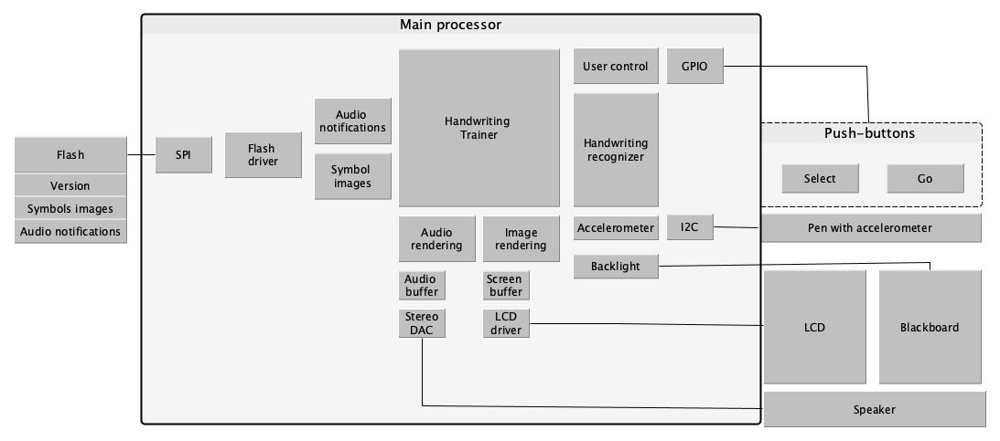

# Exercise 1: Idea project diagram

Tell us about an embedded system that does not exist. It can be grandiose or strange; it can be
something just one step beyond what you have around you. Ideally it is something you
personally want to build (even if physics doesn’t allow it). If you have a final project in mind, you
can start on that. If not, be imaginative, reality does not need to apply here.
What is it? What does it do? What general components do you need?
This should be summarized in 3-6 sentences. Then make at least one block diagram describing
the system as discussed in Chapter 2 and the associated lectures. More diagrams are better

## What is it?

This embedded system is called: "Magic Writer - A handwritting trainner for kids". It is a toy to help kids to learn how to write the numbers from 1 to 9 as well as the letters from a to z.
Figure 1 shows how Magic Writer looks like.

## What does it do?

Magic Writer works as follows:

1. Select the symbol you want to learn using the orange-button on the left. As you select, the symbols will appear on the LCD next to the button.
2. Once, you decide which symbol to learn, take the pencil and press the "go-button" on the right.
3. Magic Writer, will give you visual and audio instructions about how to write the symbol.
4. Write the symbol on the blackboard next to the LCD
5. Magic writer will recognise what you write and tell you if you wrote the selected symbol correctly.

Repeat the process to learn all avaiable symbols!

## What general components do you need?

The software block diagram in Figure 2 shows the main components of the embedded system.

