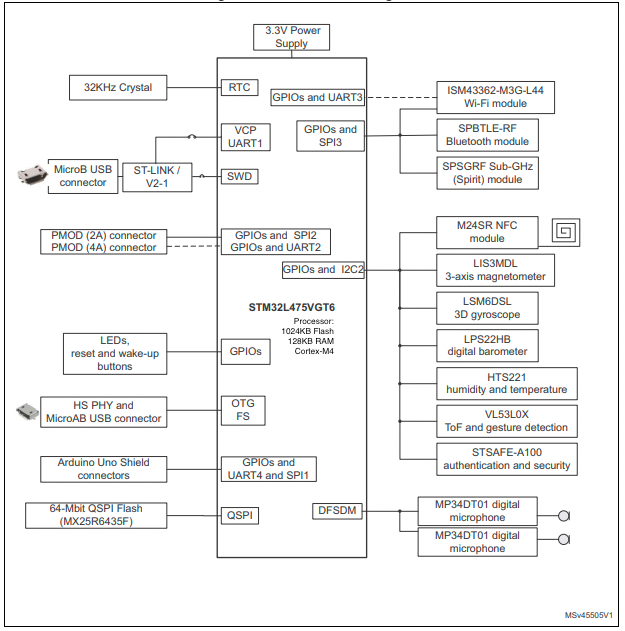

# Exercise 2: Investigate Project Boards

## Board 1: The Thunderboard Sense 2 from Silicon Labs(SLTB0004A)

The Thunderboard Sense 2 is a multi-sensor, multi- protocol development platform for IoT applications.
It is energy-friendly, provides several sensors and supports proprietary stacks and standard protocols such as Zigbee, Thread and Bluetooth.
The figure below shows a hardware block diagram for the board.

### What kind of processor is it?
The board has a EFR32MG12 Mighty Gecko Wireless SoC. This is an energy-friendly MCU with a highly integrated radio transceiver.
The MCU has a 38.4 MHz operating frequency, 1024 kB flash and 256 kB RAM
 
### How much Flash and RAM does it have? Any other memory types?
- Flash:1024 kB 
- RAM: 256 kB
- External Serial Flash: 8 Mbits (for OTA programming and data logging)

### Does it have any special peripherals?

The board has very interesting set of sensors, such as:
- Relative humidity and temperature sensor
- UV index and ambient light sensor
- Barometric pressure sensor
- Indoor air quality gas sensor
- 6-axis inertial sensor

### If it has an ADC, what are the features?

- Successive Approximation Register (SAR) architecture
- 12 bits resolution
- Up to 1Msps maximum conversion rate with full resolution
- Configurable output resolution
- Integrated voltage references
- Integrated temperature sensor
- Support both: single-ended and differential input

### How much does the board cost vs what the processor costs? Is the processor in stock anywhere?

- Board cost: 19.93 EUR 
- Processor cost: 6.21 EUR
- Availability: currently not available but it might become available in the next 3 weeks at: https://de.rs-online.com/, https://www.silabs.com/, https://www.mouser.de/ and https://www.digikey.de

## Board 2: The Discovery kit for IoT node from STM (B-L475E-IOT01A)

The board B-L475E-IOT01A  is a kit for IoT development that allows users to directly connect to the cloud servers. It includes low-power communication, multiway sensing and an Arm Cortex-M4.
The figure below shows a hardware block diagram for the board (taken from the datasheet).

### What kind of processor is it?
The board has a STM32L4 with an Arm Cortex-M4.
 
### How much Flash and RAM does it have? Any other memory types?
- Flash:1024 kB 
- RAM: 128 kB
- External Flash: 64 Mbits (with Quad-SPI connection)

### Does it have any special peripherals?

The board includes wireless communication modules and very interesting set of sensors, such as:
- Bluetooth V4.1 module 
- Low-power-programmable RF module
- 802.11 b/g/n compliant Wi-Fi module
- Relative humidity and temperature sensor
- 3-axis magnetometer sensor
- 3D accelerometer and 3D gyroscope
- Barometric pressure sensor
- Time-of-Flight and gesture-detection sensor

### If it has an ADC, what are the features?

The STM32L4 MCU has an ADC module with the following features:
- Three Successive Approximation converter
- 12 bits resolution
- Up to 5.33Msps maximum conversion rate with full resolution
- Configurable output resolution
- Up to 16 external channels and 5 internal channels
- One external reference pin is available on some package, allowing the input voltage range to be independent from the power supply
- Support both: single-ended and differential input

### How much does the board cost vs what the processor costs? Is the processor in stock anywhere?

- Board cost: 48.79 EUR 
- Processor cost: 10.08 EUR
- Availability: currently very few units are in stock at: https://www.digikey.de https://de.rs-online.com/ and https://www.mouser.de/
