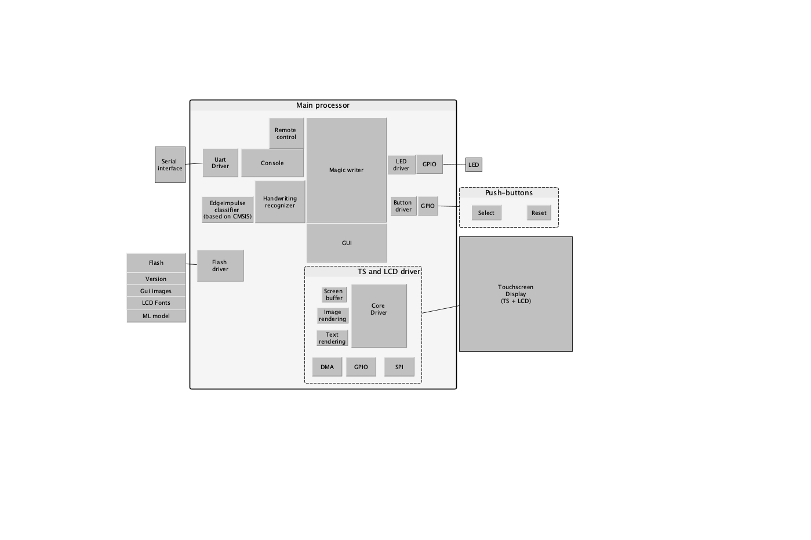

# Magic writer : A handwriting trainer for kids

Magic writer is a toy to help kids with learning how to write the numbers from 1 to 9 as well as the letters from a to z.
Figure 1 shows how Magic Writer looks like.

## System hardware

The proyect uses am stm32f4-discovery board.

## How does it work?

Magic Writer works as follows:

1. Select the character you want to learn using the *select button* on the left. As you select, the characters will be shown on the display.
2. Once you have decided which character to learn, take the pen and draw it on *the painting area*.
3. You can always clear the screen by clicking on the *clear button*.
3. When you are done drawing, click on the *check button* on the display.
5. Magic writer will predict what you have written and give you feedback to let you know if you draw the expected character.

Repeat the process to learn all avaiable characters!

## System architecture

The software block diagram in Figure 2 shows the main components of the embedded system.

The main components are described below.

### The Magic writer - state machine

	To be added

### The handwriting recognizer

The handwriting recognizer is based on a machine learning model develop with Edge-impulse.
The input to the model is a 28x28 png black-and-white image and the output is a label representing a character.

The model was trained with images from [the NIST database](https://www.nist.gov/srd/nist-special-database-19) which contains training images for handprinted character recognition.

The workflow follow can be described as follows:
 1. Select a set of images form the database to be used as a input data set. Magic writer uses a sub-set of the hsf_4 partition.
 2. Pre-process the selected images and perform data-augmentation to improve the quality of the ML-model. See:
 	- [Input data set](https://drive.google.com/drive/folders/17RtXM1MVcgyUMoeIjmoOlJwrE-I_i-8W)
 	- [Processing python script](https://colab.research.google.com/drive/1YkGoW1ZgTk_fhABNCcS_HA6v-yvXLbE0#scrollTo=ZkEKJ7g9u21N)
 	- [Output data set](https://drive.google.com/drive/folders/1uDkGckb4qN-0c4PEV3rjXwat7OAA4WyX)
 3. Create a project in edge-impulse to load the images and develop [the model](https://studio.edgeimpulse.com/public/108724/latest).
 4. Generate a CubeIDE library from the edge-impulse proyect and integrate it as explained [here](https://docs.edgeimpulse.com/docs/deployment/using-cubeai)
 5. Encapsulate the model into a software module that gets a flat-28x28-image and return the predicted character.

The model metrics are shown below:

